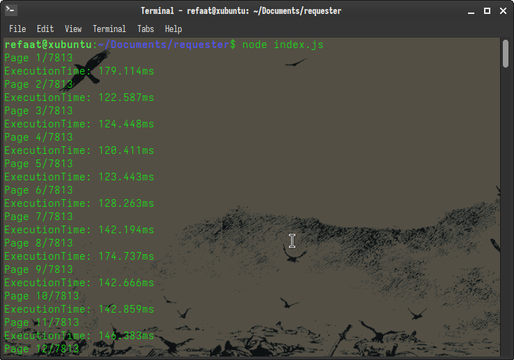
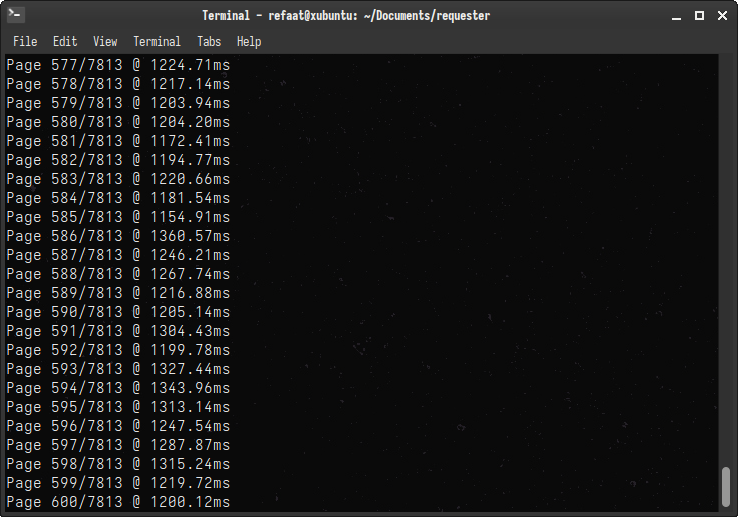
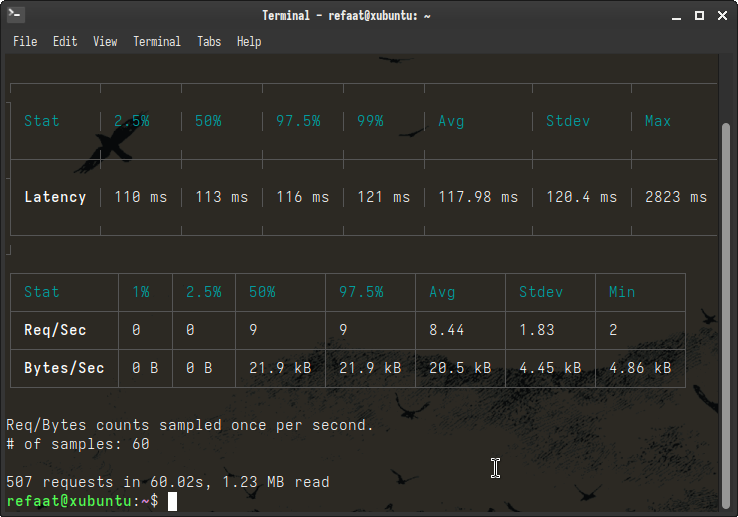

# Not Blind


> Not Blind is my journey to one million requests per second

## About The Project
The main purpose of this project is to learn about web scaling. My goal is to create a robust backend that can (hopefully) scale up to
one million requests per second. This project will have different iterations, with this being the first. I plan to scale up from 
Sqlite to PostgrSQL & Redis. I am sure that along the way I will find out about new technologies & techniques to optimize the way
this server handles requests. I will be sure to document these finding here in this repository, as well as some benchmarks using
autocannon & the Node.js fetch api.

### Under The Hood
Right now there is nothing too interesting happening. A basic Node.js/Express.js application binded to an instance of Sqlite3. The 
server is structured through the controller-service-repositotry design pattern, and middleware is being used for validation & 
error handling. There is also a custom Query Builder I wrote to help build dynamic queries based on request url parameters to filter 
the data. There is a lot more to be desired but the basic foundations are here to start optimizing for requests per second. More info about
the api can be found here.

### Limitations
The current iteration of this project is super slow because I am using synchronous libraries. Even though libraries like `node:sql` 
and `better-sqlite3` are super fast, they dont expose their api with asynchronous functions. This means that every function call to 
the database blocks the Node.js event loop. And because Node.js is single threaded, it will block other incoming requests, which will
slow everything down, and might even get some requests timed out giving us this horrible user experience! It's also worth pointing out
that I am using `LIMIT ? OFFSET ?` clauses to paginate. Offset works by scanning an `n` amount of rows & then dropping them once it reaches
`n`. It basically has a time complexity of O(n). I plan to find a solution to this in later iterations, but for now here is the difference
in request time when fetching only the first few 400 pages. It's pretty bad!

<p align="center">
  
</p>

<p align="center"><b>Starts off fast but gets slower because of O(n) time complexity</b></p>

<p align="center">
  
</p>

### Benchmarks

```bash
  autocannon -c 1000 -d 20 -p 10 http://127.0.0.1:3000/api/ip
```

<p align="center">
  
</p>


## API
<details>
 <summary><code>GET</code> <code><b>/api/ip?{ipAddress}{country}{dateStart}{dateEnd}{page}{limit}</b></code> <code>Gets ip addresses w/ optional queries</code></summary>

##### Query
> | name      | type     | data type | default | description                                              |
> |-----------|----------|-----------|---------|----------------------------------------------------------|
> | ipAddress | Optional | string    | N/A     | Filters for the specified ip address                     |
> | country   | Optional | string    | N/A     | Filters for the specified country in ISO 3166 A-2 format |
> | dateStart | Optional | string    | N/A     | Filters for ip's created after the dateStart specified   |
> | dateEnd   | Optional | string    | N/A     | Filters for ip's created before the dateStart specified  |
> | Page      | Optional | string    | 1       | Page                                                     |
> | Limit     | Optional | string    | 8       | Row limit. One of 8, 16, 32, 64 or 128                   |

##### Responses
> | http code     | content-type                      | response                                                            |
> |---------------|-----------------------------------|---------------------------------------------------------------------|
> | `200`         | `application/json`                | `{pagination: totalPages, totalRows, currentPage, currentRow, links: {first, last, net, prev}, result: [{}]}`                                                                                                              |
> | `400`         | `application/json`                | `{"code":"400","message": '"ip_address" is not allowed' }`                      |
> | `400`         | `application/json`                | `{"code":"400","message": '"Country" is not allowed' }`                         |
> | `400`         | `application/json`                | `{"code":"400","message": '"date_start" is not allowed'}`                       |
> | `400`         | `application/json`                | `{"code":"400","message": '"dateEnd" is not allowed'}`                          |
> | `400`         | `application/json`                | `{"code":"400","message": '"ipAddress" must be a valid ip address of one of the following versions [ipv4] with a optional CIDR'}`                                                                                       |
> | `400`         | `application/json`                | `{"code":"400", "message":  '"country" must be in ISO 3166 A-2 format'}`        |
> | `400`         | `application/json`                | `{"code":"400", "message":  '"dateStart" must be in iso format'"}`              |
> | `400`         | `application/json`                | `{"code":"400", "message":  '"dateEnd" must be in iso format'"}`                |
> | `400`         | `application/json`                | `{"code":"400", "message":  '"page" must be a number'}`                         |
> | `400`         | `application/json`                | `{"code":"400", "message":  '"limit" must be a number'}`                        |


##### Example cURL
> ```javascript
>  curl -X GET http://127.0.0.1:3000/api/ip?country=CA&dateStart=2026-05-01T00:00:00&dateEnd=2026-05-31T00:00:00
> ```
</details>


<details>
 <summary><code>GET</code> <code><b>/api/ip/{id}</b></code> <code>Gets ip address from unique identifier</code></summary>

##### Parameters
> | name      | type     | data type | default | description                                              |
> |-----------|----------|-----------|---------|----------------------------------------------------------|
> | id        | Required | string    | N/A     | Unique identifier for an ip address                      |

##### Responses
> | http code     | content-type                      | response                                                                  |
> |---------------|-----------------------------------|---------------------------------------------------------------------------|
> | `200`         | `application/json`                | `{id:"8ed9825a0b6f9a03d797fb1695423298", ip_address:"117.237.13.206", country:"CN", created_at: "2025-01-01 00:00:44"}`                                                                                 |
> | `400`         | `application/json`                | `{"code": 400,"message": '"id" length must be 32 characters long' }`      |
> | `400`         | `application/json`                | `{"code": 400,"message": '"id" must only contain hexadecimal characters'}`|
> | `400`         | `application/json`                | `{"code": 400,"message": '"id" must only contain hexadecimal characters'}`|
> | `400`         | `application/json`                | `{"code": 400,"message": "Cannot find an IP Address with the ID 8ed9825a0b6f9a03d797fb169542329F" }`                                                                                              |

##### Example cURL
> ```javascript
>  curl -X GET http://127.0.0.1:3000/api/ip?/8ed9825a0b6f9a03d797fb1695423298
> ```
</details>

<details>
 <summary><code>POST</code> <code><b>/api/ip</b></code> <code>Logs an ip address to the database</code></summary>

##### Query
> | name      | type     | data type      | default | description |
> |-----------|----------|----------------|---------|-------------|
> | ipAddress | Required | Object (JSON)  | N/A     | N/A         |
> | country   | Required | Object (JSON)  | N/A     | N/A         |
> | dateStart | Required | Object (JSON)  | N/A     | N/A         |
> | dateEnd   | Optional | Object (JSON)  | N/A     | N/A         |

##### Responses
> | http code     | content-type                      | response                                                            |
> |---------------|-----------------------------------|---------------------------------------------------------------------|
> | `200`         | `application/json`                | `{"code": 200, "message": 'Persistance successful!'}`               |
> | `400`         | `application/json`                | `{"code":"400","message":"Bad Request"}`                            |
> | `400`         | `application/json`                | `{"code":"400","message": '"ip_address" is not allowed' }`                      |
> | `400`         | `application/json`                | `{"code":"400","message": '"Country" is not allowed' }`                         |
> | `400`         | `application/json`                | `{"code":"400","message": '"ipAddress" must be a valid ip address of one of the following versions [ipv4] with a optional CIDR'}`                                                                                       |
> | `400`         | `application/json`                | `{"code":"400", "message":  '"country" must be in ISO 3166 A-2 format'}`        |

##### Example cURL
> ```bash
>  curl -X POST http://127.0.0.1:3000/api/ip
>       -H "Content-Type: application/json" http://127.0.0.1:3000/api/ip 
>       -d { "ipAddress": "142.66.8.36", "country": "CA" }
> ```
</details>

## Getting Started
These instructions will help you get a copy of this project up & running on your machine.

### Prerequisites 
You **must** have Node.js, Mocha, and Sqlite3 installed on your system

### Installation 
Clone the repository to your local machine:
```bash
refaat@xubuntu:~$ git clone https://github.com/Refaat0/notblind
```

Install dependancies:
```bash
refaat@xubuntu:~/notblind/server$ npm install
```

Create a .env file:
```bash
  nano ./server/.env
  HOST=http://127.0.0.1:
  PORT=3000
```

Create & populate a Sqlite database
```bash
  sqlite3 ./server/src/database/development.db < ./server/src/database/migrations/01-create-database.sql
  sqlite3 ./server/src/database/development.db < ./server/src/database/migrations/01-insert-dumb-data.sql
```

Run the tests:
```bash
refaat@xubuntu:~/notblind/server$ npm test
```

Run the program:
```nano
refaat@xubuntu:~/notblind/server$ node ./index.js
```
